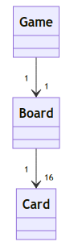
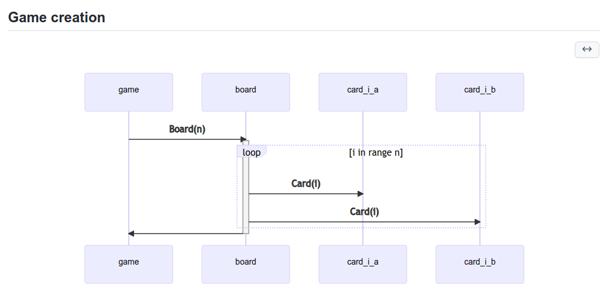

# Arkkitehtuuri

## Sovelluslogiikka

Pelin logiikka on jaettu kolmiosaiseen luokka-arkkitehtuuriin. Peliluokka Game hyödyntää toiminnassaan lautaa, joka puolestaan hyödyntää useita kortteja.

Kun uusi peli aloitetaan, generoidaan sen mukana uusi lauta ja kortit.

Uuden pelin luomisen prosessi käy ilmi seuraavasta kaaviosta:

Tämän jälkeen peliä pelatessa kortin klikkaaminen hiirellä kutsuu aina korttia avaavaa metodia. Kun kaksi korttia ollaan avattu, vuorossa oleva pelaaja vaihtuu. Tämän jälkeen kutsutaan metodia joka sulkee nämä kortit, paitsi jos ne ovat pari, jolloin ne pysyvät auki. Peli pysyy tässä silmukassa avaten ja sulkien kortteja, kunnes kaikki kortit on avattu.

## Käyttöliittymä

Muistipelin käyttöliittymä on toteutettu pygamella. Käynnistyksen jälkeen kaikki toiminnot voidaan toteuttaa hiirellä klikkaamalla. Tämän vuoksi käyttäjän antama syöte on laadultaa hyvin rajallista, eikä sen pitäisi johtaa virhetilanteisiin.

Käyttöliittymä sisältää 4 (käytännössä 6) erilaista näkymää. Koko käyttöliittymä on toteutettu yhteen luokkaan.

Aloitusnäkymästä voi valita haluamansa pelitilan (yksin- tai moninpeli) tai siirtyä katsomaan huipputulosta

Pelitilassa tapahtuu itse pelaaminen. Siinä näkyy kortteja, joita voi avata klikkaamalla. Suurin osa toiminnallisuudesta painottuu tähän näkymään. Pelitilasta on olemassa kaksi eri versiota riippuen siitä, pelataanko yksin- vai moninpeliä. Pelin päätyttyä siirrytään voittonäkymään.

Voittonäkymässä näkyy pelin lopputulos. Siitä voi siirtyä takaisin aloitusnäkymään.

Tulosnäkymästä näkee tämänhetkisen yksinpelitilan huipputuloksen. Tulosnäkymästä voi siirtyä takaisin aloitusnäkymään.

## Rakenteelliset heikkoudet

Käyttöliittymän pääluokka on käytännössä yksi pitkä ja toisteinen silmukka. Tämän voisi pilkkoa pienempiin metodeihin, mutta pygame aiheuttaa minulle jo nyt niin suurta päänvaivaa etten halunnut lähteä säätämään sen kanssa yhtään tämän enempää.
