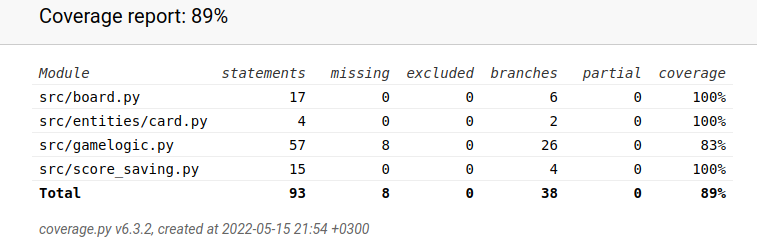

# Testaus

Koodia on testattu Unittestillä käsinkirjoitetuin testein sekä myös manuaalisesti koodin kirjoituksen yhteydessä käynnistämällä ohjelma ja pelaamalla muistipeliä. 

## Testikattavuus

Käyttöliittymää lukuunottamatta testauksen haaraumakattavuus on 89%

Testaamatta on jätetty pelin lopetukseen liittyviä tilanteita koska kaikkien korttien avaaminen paria testiä varten tuntui työläältä ja olin jo testannut tätä manuaalisesti. Jotkin yksinpeliversion metodit ovat myös testeiltään vajaita koska luokka on toiminnaltaan niin samanlainen kuin sen pohjana toimiva peruspeli luokka.

## Sovelluksen ja testauksen puutteet

Sovellusta ei ole testattu eri järjestelmäympäristöissä kovinkaan paljoa, koska Pygame tekee tästä haastavaa.

Sulkemisen yhteydessä ongelma antaa virheilmoituksen, koska silmukka ei pääty oikein.
