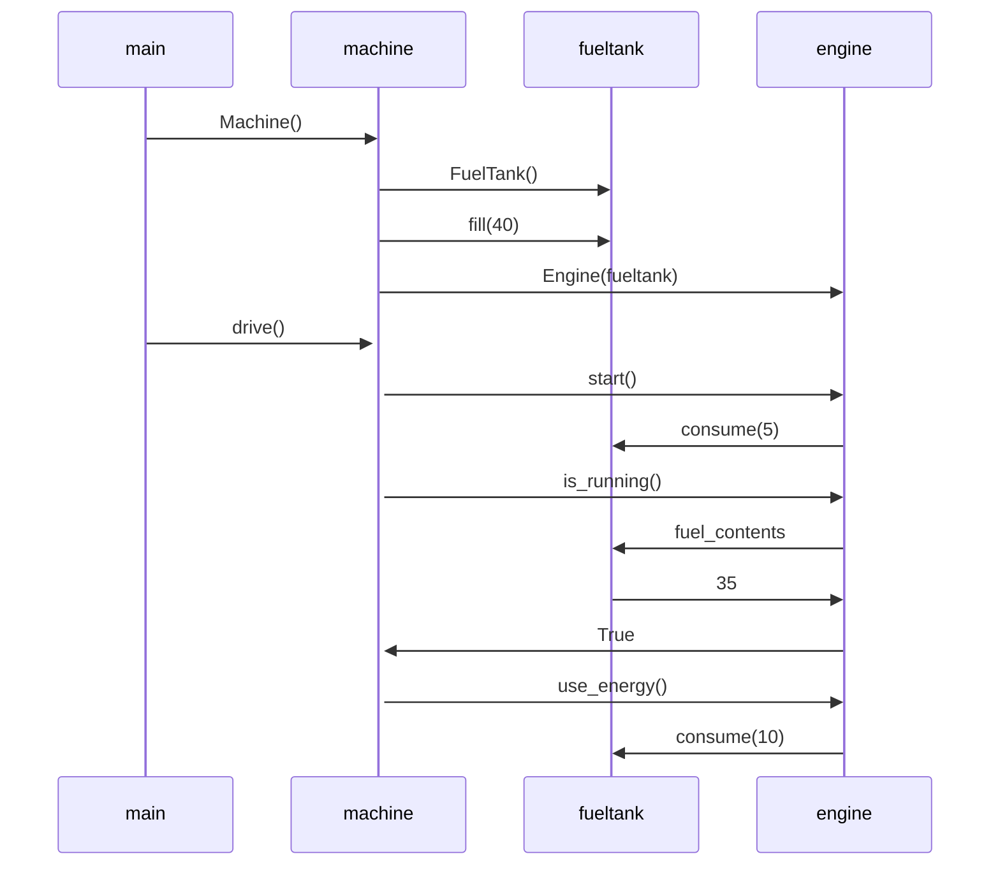

```mermaid
sequenceDiagram

main ->> machine: Machine()
machine ->> fueltank: FuelTank()
machine ->> fueltank: fill(40)
machine ->> engine: Engine(fueltank)

main ->>+ machine: drive()
machine ->> engine: start()
engine ->> fueltank: consume(5)
machine ->> engine: is_running()
engine ->> fueltank: fuel_contents
fueltank ->> engine: 35
engine ->> machine: True
machine ->> engine: use_energy()
engine ->> fueltank: consume(10)
```
